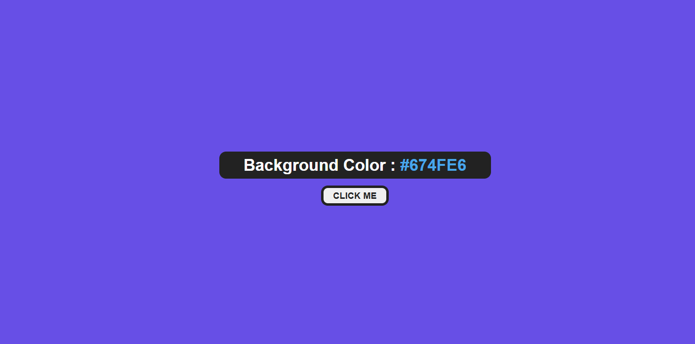

# Color Flipper

A simple color flipper web page inspired by [John Smilga's tutorial](https://www.freecodecamp.org/news/javascript-projects-for-beginners/#heading-how-to-create-a-color-flipper) about how to create a random backgfground color changer.

